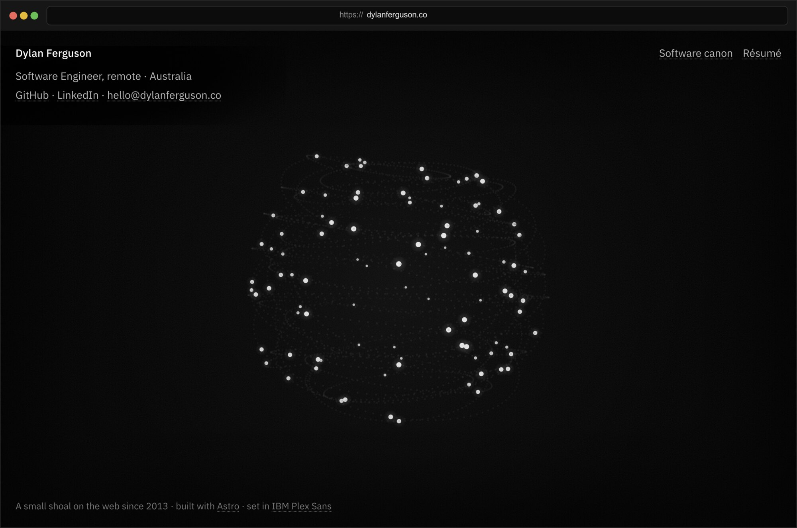

# 🌐 dylanferguson.co

<p align="center">
  <a href="https://dylanferguson.co/">
    
  </a>
</p>

A small shoal on the web since 2013, forever a work in progress

## Development

[mise](https://mise.jdx.dev/) pins Node.js 24. [pnpm](https://pnpm.io/) is the package manager.

```sh
mise install
pnpm install
pnpm dev
```

```sh
pnpm dev        # Astro development server
pnpm build      # write dist/
pnpm verify     # types, lint, build, résumé PDF freshness
pnpm resume     # print /resume/ to public/resume.pdf
pnpm format     # format source and data files
```

`pnpm install` points git at `.githooks/`. Commits then run `pnpm verify`.

Pushes to `main` deploy.
